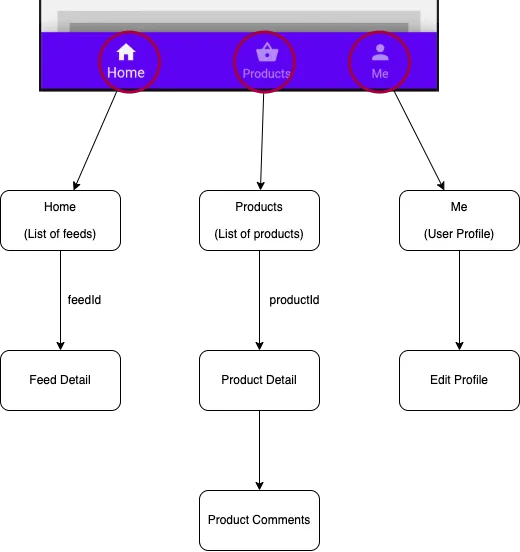

When it comes to routing from a widget which has a Navbar setup it is important to decide whether the Navbar should persist on pushing a new route or not. If the Navbar needs to be hidden then the route should be pushed onto the Flutter's Navigation stack (on top of NavbarRouter). But if we want the Navbar to persist then we should push the route ontop of the existing route (Within NavbarRouter).

NavbarRouter uses this approach by Wrapping each NavbarItem with a [Navigator](https://api.flutter.dev/flutter/widgets/Navigator-class.html) and pushing the route ontop of the existing route.

Consider a rough diagram of a sample app with 3 Navbar items and each item has a nested routes.

<center></center>

So we need to declare a Map of routes as follows

```dart
  final Map<int, Map<String, Widget>> _routes = const {
    0: {
      '/': HomeFeeds(),
      FeedDetail.route: FeedDetail(),
    },
    1: {
      '/': ProductList(),
      ProductDetail.route: ProductDetail(),
      ProductComments.route: ProductComments(),
    },
    2: {
      '/': UserProfile(),
      ProfileEdit.route: ProfileEdit(),
    },
    3: {
      '/': Settings(),
    },
  };
```

The key of the outer Map is the index of the NavbarItem. The key of the inner Map is the route name and the value is the Widget to be displayed. Each key in the outer map must have a key `/` which is the initial route (default) for that NavbarItem.

For instance `HomeFeeds()` is the initial route for the first NavbarItem. if you want to change the initial route for a NavbarItem, then you need to specify that in `DestinationRouter` when specifying list of destinations.

```dart
  destinations: [
    for (int i = 0; i < items.length; i++)
      DestinationRouter(
        ...
        initialRoute: _routes[i]!.keys.first, // specify the initial route for each tab here
      ),
  ]
```

### Pushing Routes within NavbarItem (Persists Navbar by default)

_A helper class `Navigate` is built within NavbarRouter to push routes_
This class is a wrapper around Flutter's [Navigator](https://api.flutter.dev/flutter/widgets/Navigator-class.html) and provides a simple API to push routes. It also makes possible to add transitions to routes with a enum `TransitionType`.

Setting the `isRootNavigator` to `false` will push the route ontop of the existing route (Within NavbarRouter)

````dart

```dart
 Navigate.pushNamed(context, ProductDetail.route,
  isRootNavigator: false,
  arguments: {'id': index.toString()}
);
````

> Note that you can still choose to hide the Navbar by calling `NavbarNotifier.hideNavbar = true`.

### Pushing Routes on top of NavbarRouter

if you want to push a router on top of NavbarRouter you simply need to set the `isRootNavigator` to `true` (default)

```dart
 Navigate.pushNamed(context, ProductDetail.route,
  isRootNavigator: true,
  arguments: {'id': index.toString()}
);
```

> Note when using named routes with `isRootNavigator: true` you need to specify the route name in the `routes` parameter of `MaterialApp` or `CupertinoApp` widget.

### Push/Pop Routes in the background.

#### Push Routes

NavbarRouter provides flexibility to push route in the background. This is useful when you want to push a route in the background and then navigate to it later. No extra configuration is required you can programmatically push/pop routes in any tab. Here is a sample code from the [example app](https://github.com/maheshmnj/navbar_router/blob/ccaa74124e1a72df53217a39e71b3e1e71dce5eb/example/lib/main.dart#L477)

When you tap on the first item in the list it will push a route in the background and then navigate to it programmatically.

```dart
      body: ListView.builder(
          controller: _scrollController,
          itemBuilder: (context, index) {
            return Padding(
              padding: const EdgeInsets.all(8.0),
              child: InkWell(
                  onTap: () {
                    if (index == 0) {
                      NavbarNotifier.pushNamed(FeedDetail.route, 0);
                      NavbarNotifier.showSnackBar(context, 'switching to Home',
                          onClosed: () {
                        NavbarNotifier.index = 0;
                      });
                    } else {
                      NavbarNotifier.hideBottomNavBar = false;
                      Navigate.pushNamed(context, ProductDetail.route,
                          transitionType: TransitionType.scale,
                          arguments: {'id': index.toString()});
                    }
                  },
                  child: ProductTile(index: index)),
            );
          }),
    );
  }
```

#### Pop Routes

You can also pop a route from any tab you just need to specify the index of the tab. If Navbar is already at the base route (initial route) then it will not pop the route.

```dart
  NavbarNotifier.popRoute(index);
```

