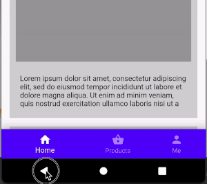
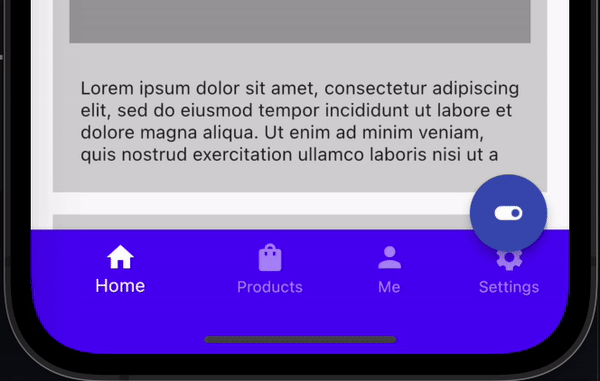
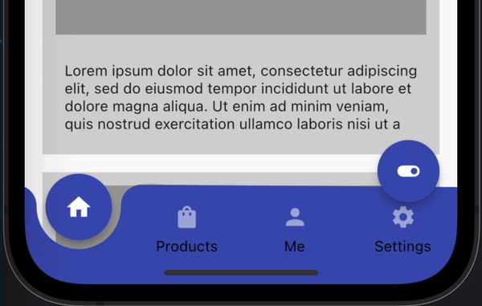
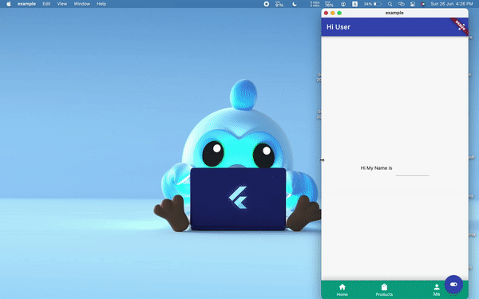

## Main Features

### Hide/Show Navbar

You can hide or show bottom navigationBar with a single line of code from anywhere in the widget tree. This allows you to handle useCases like scroll down to hide the navbar or hide the navbar on opening the drawer.

```dart
NavbarNotifier.hideBottomNavBar = true;
```

_Hide/show navbar on scroll_


_Hide/show navbar on drawer open/close_


### Intercept BackButton press events (Android)

When the selected NavbarItem is at the root of the navigation stack (initial route), pressing the Back button (On Android) will by default trigger app exit which is correct. But sometimes you might want to intercept this event and do some chore work before exiting the app.

_navbar_router_ provides a `onBackButtonPressed` callback to intercept events from android back button, giving you the ability to handle app exits so as to prevent abrupt app exits without users consent.

This callback method must return `true` to exit the app and false other wise.

_sample code implementing double press back button to exit_

```dart
onBackButtonPressed: (isExitingApp) {
  if (isExitingApp) {
    newTime = DateTime.now();
    int difference = newTime.difference(oldTime).inMilliseconds;
    oldTime = newTime;
    if (difference < 1000) {
      hideSnackBar();
      return isExitingApp;
    } else {
      showSnackBar();
      return false;
    }
  } else {
    return isExitingApp;
    }
  },
```



### Support for different Navbar Types

NavbarRouter supports 3 different types of Navbars as of today and intends to add more in the future.

#### Standard Navbar



#### Notched Navbar



#### Material 3 Navbar


See [Types of Navbar](./types) for more details.

### Pop to Base route (Similar to Instagram)

When your NavbarItems have multiple nested routes in the stack, tapping the same tab twice will pop to the base route of the NavbarItem. This is similar behaviour to Instagram where tapping the same tab twice pops to the base route.

For instance if you have a List of products on tab 2 and you navigate deep within that tab
Product List->Product Details->Product Reviews->Product Review Details and then you tap the same tab again, it will pop to the base route of the tab (Product List).

See [Routes and Navigation](./routes-and-navigation.md) for more details.

_Output: Tapping the same tab twice pops to base route._


### Adaptable to different device sizes.

Now that flutter has gone beyond mobile and supports multiple plaforms and devices of different form factor. NavbarRouter adds support for responsive navbar. It will adjust the navbar based on the screen size. To switch to desktop mode we have to set `isDesktop: true`.

The below code snippet shows Navbar switching to desktop mode when screen width goes beyond 600px.

```dart
 NavbarRouter(
   errorBuilder: (context) {
     return const Center(child: Text('Error 404'));
   },
   isDesktop: size.width > 600 ? true : false,
   decoration: NavbarDecoration(
     isExtended: size.width > 800 ? true : false,
     navbarType: BottomNavigationBarType.shifting),
   ...
   ...
);
```

_Output: Switches to desktop mode on resizing the window._


