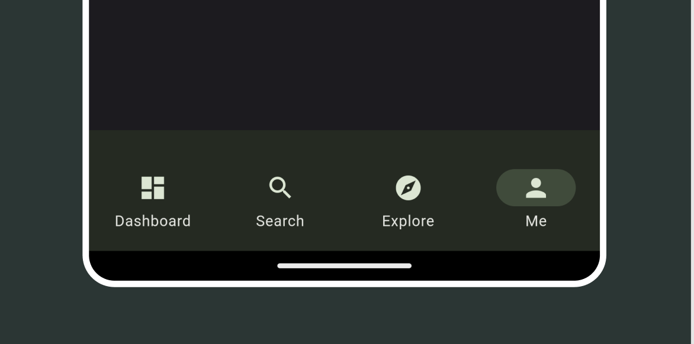

# NavbarRouter



NavbarRouter is a complete package to handle all your BottomNavigationBar needs. It provides a simplest api to achieve the advanced features of BottomNavigationBar making the user experience of your app much better. You only need to specify the NavbarItems and the routes for each NavbarItem and NavbarRouter will take care of the rest.

### Key Features

- Choose between different NavigationBar types.
- Remembers navigation history of Navbar (Android).
- Persist Navbar when pushing routes
- Intercept back button press to handle app exits (Android).
- Fading between NavbarDestinations
- Programmatically control state of bottom navbar from any part of widget tree e.g change index, hide/show bottom navbar, pop routes of a specific tab etc
- Show Snackbar messages on top of Navbar with a single line of code.
- persist state across bottom navbar tabs.
- Jump to base route from a deep nested route with a single tap(same as instagram).
- Adapatable to different device Sizes.

**For more detailed explanation see [features section](/features)**

> This package can effortlessly trim down your codebase by a remarkable 50% and expedite the implementation of the aforementioned features by half the time.
> Heres the same [sample app](https://gist.github.com/maheshmnj/894922ccb67f5fdc4ffb652e41916fa2) without the package which requires around 800 lines of code.

## Terminology

Some of the terms you should be familiar with before using the package.

### NavbarItem

It is a single item in the NavigationBar. It takes in the following parameters.

- **icon**: The icon to be shown in the navbar.
- **label**: The label to be shown in the navbar.
- **route**: The route to be pushed when the NavbarItem is selected.

```dart

NavbarItem(
  icon: Icons.home,
  label: 'Home',
  route: '/',
),
```

### Destination

It is a single destination to be pushed on the Navigator associated with the NavbarItem. It takes in the following parameters.

- **route**: The route to be pushed on the Navigator associated with the destination.
- **widget**: The widget to be pushed on the Navigator associated with the path.

```dart
Destination(
  route: _routes[i]!.keys.elementAt(j),
  widget: _routes[i]!.values.elementAt(j),
),
```

### DestinationRouter

It is a wrapper class to bind `NavbarItem` and `Destination` widgets. It takes in the following parameters.

- **navbarItem**: The NavbarItem to be shown in the navbar.
- **destinations**: The list of destinations to be pushed on the Navigator associated with that NavbarItem, when the NavbarItem is selected.

```dart
DestinationRouter(
  navbarItem: items[i],
  destinations: [
    for (int j = 0; j < _routes[i]!.keys.length; j++)
      Destination(
        route: _routes[i]!.keys.elementAt(j),
        widget: _routes[i]!.values.elementAt(j),
      ),
  ],
  initialRoute: _routes[i]!.keys.first,
),
```

Want to understand how routing and Navigation works under the hood see the [Routing and Navigation](./routes-and-navigation) section.
