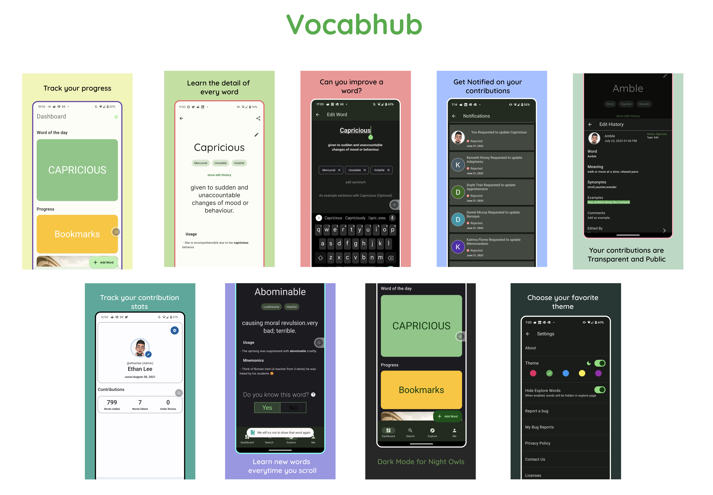

## ShowCase

navbar_router was built to make it easy to add BottomNavigattion bar capability along with the ability to achieve complex features that help streamline a great user experience with minimal code. In an effort to showcase the power of navbar_router and hear what developers have to say we have launched this showcase page, where you can showcase your beautiful app to navbar_router community.

Here are some of the apps that are using navbar_router to power their BottomNavigationBar in their apps.

### [Vocabhub](https://play.google.com/store/apps/details?id=com.vocabhub.app)

**_Vocabhub is a crowd-sourced vocabulary app designed to help users enhance their vocabulary and language skills. It offers a curated collection of common GRE words, fosters community-driven learning, and provides a personalized learning experience_**

> If you are a Indie App Developer or a Company using navbar_router and want to showcase your Beautiful App, Please drop your app details in this [issue thread](https://github.com/maheshmnj/navbar_router/issues/34). We would love to add your App to the Showcase.
