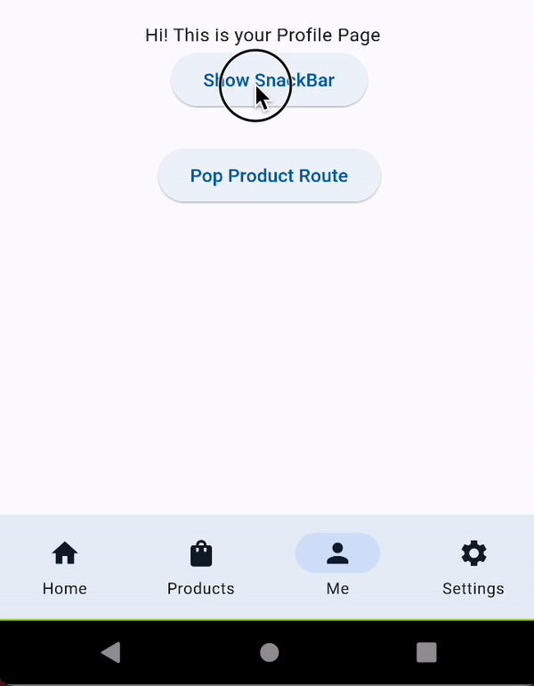

### Showing Snackbars with NavbarRouter

<Image
  caption="Source material design 3 website"
  src="https://lh3.googleusercontent.com/ouM2kMQeInKbisw5lZtEjXDYRuiywHvsVqKWxddCg3fGYowbnRK85GUicf7m2UX8eGfD2LSTuApw4dGZa1NW-TpeqzhJXCHTItm8L_PCUhL4=s0"
/>

Snackbar is a component that is used to display a message for a short period of time and then automatically disappear. It can be used to display a short message or an action that a user has performed. It is a good way to give feedback to the user.



Showing Snackbar with NavbarRouter is very easy. You just need to use the `showSnackbar` method of the `NavbarRouter`. The `showSnackbar` method requires a context and a message.

```dart
NavbarNotifier.showSnackBar(
  context,
  "This is shown on top of the Floating Action Button",
);
```

And hide it using the `NavbarNotifier.hideSnackBar` method.

```dart
NavbarNotifier.hideSnackBar(context);
```

_Note that This api supports minimal customization as of now and intends to add all the customization options that the material design snackbar supports._

Supported customization options:

- **showCloseIcon**: Whether to show the close icon or not. (defaults to true)
- **actionLabel**: The label of the action button. Both onPressed and actionLabel are required to show the action button.
- **onPressed**: The callback to be called when the action button is pressed. Both onPressed and actionLabel are required to show the action button.
- **duration**: The duration for which the snackbar should be shown. (defaults to 3 seconds)
- **bottom**: The margin from the bottom of the screen. (defaults to [kNavbarHeight])
