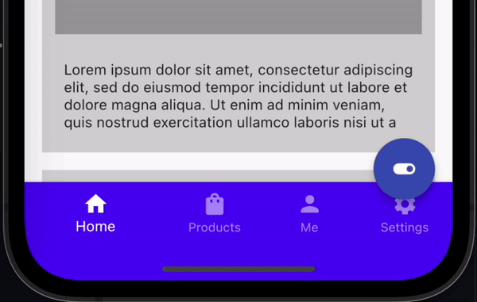
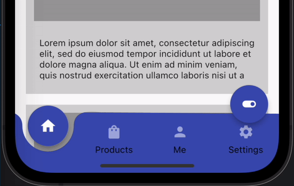
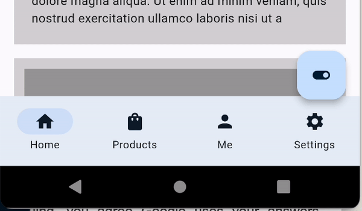
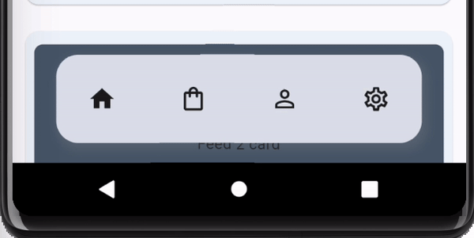

### Choose between Navbars

NavbarRouter supports three types of Navbar as of today `standard` which is basically material design 2 BottomNavigationBar (default for this package) and `notched` a customized NavigationBar with a notch and a material3 Navbar. User can choose to use either of them by setting the `type` property of the `NavbarRouter` widget to either `NavbarType.standard`, `NavbarType.notched`, `NavbarType.material3` or `NavbarType.floating`.

#### Standard Navbar

#### Notched Navbar

#### Material 3 Navbar

#### Floating Navbar

The height of each Navbar can be accessed through the constants `kM3NavbarHeight`
`kStandardNavbarHeight`, `kNotchedNavbarHeight` and `kFloatingNavbarHeight` respectively.

### Decorating the Navbar

- `NavbarDecoration` for Standard Navbar
- `NotchedDecoration` for Notched Navbar
- `M3NavbarDecoration` for Material3 Navbar
- `FloatingNavbarDecoration` for Floating Navbar
